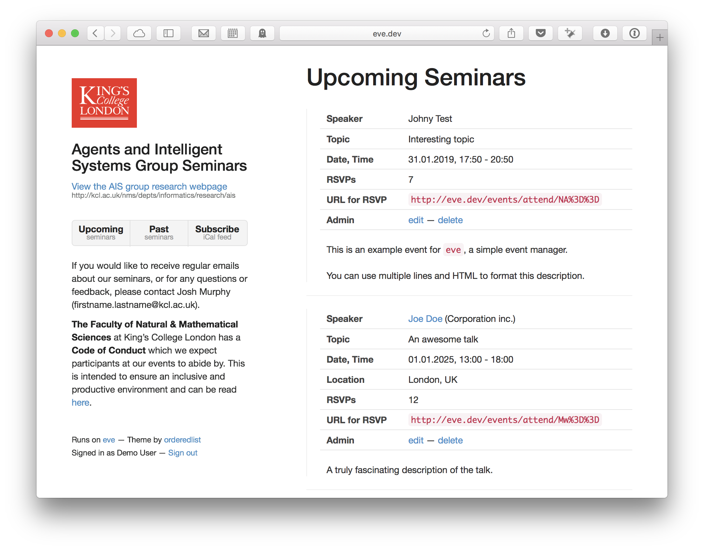

# eve: simple event manager

`Note:` This is a custom version of `eve` for DAI research group at
King's College London running at [https://nms.kcl.ac.uk/ais/seminars/](https://nms.kcl.ac.uk/ais/seminars/).
If you'd like to use `eve`, please check `master` branch.

______

Do you organise regular seminars and need a simple way to advertise
upcoming seminars and their speakers?

`eve` provides an easy way to manage and render lists of both
upcoming and past events. `eve` also generates an **iCal feed** of
all upcoming events to enable attendees to subscribe to your events.
Lastly, `eve` provides an URL to **count number of interested attendees**.

`eve` uses [Nette](http://nette.org/) framework and is written in PHP.

## Screenshot

## Installing

 - Run `composer update`
 - Make directories `tmp/cache` and `tmp/log` writable
 - Point your webserver to `www` directory
 - Open in your browser
 - Go to `http://your-website.com/admin` to open administration
 - Default login is `demo` and password `demo`

## Creating a new admin user

You can remove the default user and / or create a new admin user directly in
SQLite database located in `app/model/events.db3` using you favourite SQLite
management tool (such as [DB Browser for SQLite](http://sqlitebrowser.org/)).

When changing or creating a new password, you can enter it directly into
the database in plaintext, it will be hashed first time the user logs in.

## Interested attendees

Sometimes, it is useful to find out how many attendees is interested in
attending the seminar, so that you can arrange a proper room or catering.

If you login to `eve` administration, each event will list a unique `URL for RSVP`.
You can copy this URL into emails or forum posts and ask everybody interested in
attending to click it, their interest will be recorded. If you log in,
each event will then shows the total number of interested attendees.

## Requirements

- **PHP** >= 5.6 with `SQLite` support
- **Apache** with `mod_rewrite` support

## License

MIT © [Tomas Vitek](https://tomasvitek.com)
